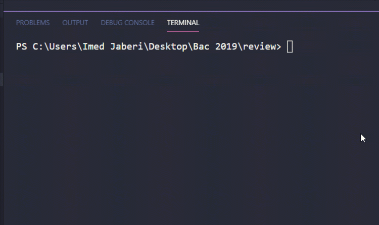

# BAC INFO - ALGORITHMS & PROGRAMMING 
###### 2018-2019
---
## This is my correction code of the 'problem exercice' in Bachelor National Test 💯 ..

## What technologies that i used ?
 - Pascal / Object Pascal 

## Setup prerequists
  - you have to install [ FPC ( free pascal compiler ) ](https://www.freepascal.org/download.var) ..

## How to run the application
 - Clone or download files in some place.
 - Open CMD or Terminal in the root folder you just cloned.
 - Go to source folder with this command `cd ./src/ ` then write this command `fpc bac.pas ` then this `./bac.exe` to run.

## Demo

